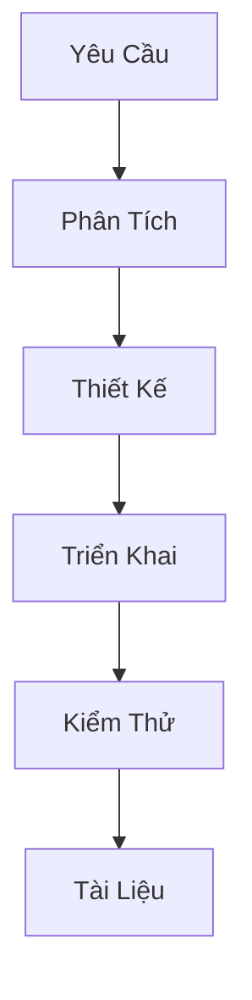

# Hướng Dẫn Phát Triển Node.js Backend

## Công Nghệ Sử Dụng

### 1. Core Technologies
- Node.js >= 14
- TypeScript
- Express.js
- Inversify (DI Container)
- Jest (Testing)
- Vite (Frontend)

### 2. Port Configuration
```env
# Backend (.env)
PORT=4000  # Backend port

# Frontend (vite.config.ts)
export default defineConfig({
  server: {
    port: 5173,  # Vite default port
    proxy: {
      '/api': {
        target: 'http://localhost:4000',
        changeOrigin: true
      }
    }
  }
})
```

### 3. Cấu Hình CORS
```typescript
// backend/src/app.ts
app.use(cors({
  origin: 'http://localhost:5173', // Vite dev server
  credentials: true
}));
```

### 2. Database
- Oracle Database
- oracledb (Node.js driver)

### 3. Authentication
- JWT (JSON Web Token)
- bcrypt (Password hashing)

## Quy Tắc Chung

### 1. Flow Chuẩn Cho Mỗi Tính Năng


### 2. Cấu Trúc File Chuẩn
```
src/
├── domain/           # Business Logic
│   ├── entities/     # Domain Entities
│   ├── value-objects/# Value Objects
│   ├── services/     # Domain Services
│   └── repositories/ # Repository Interfaces
├── infrastructure/   # External Services
│   ├── repositories/ # Repository Implementations
│   └── services/     # External Services
└── interfaces/       # API Layer
    └── controllers/  # Controllers
```

## Quy Tắc Phát Triển

### 1. Không Tự Ý Thay Đổi Logic
- Giữ nguyên logic đã được định nghĩa
- Không thêm/xóa các bước trong flow
- Không thay đổi cấu trúc dữ liệu đã có

### 2. Quy Tắc Đặt Tên
- Entities: PascalCase (User, Order)
- Value Objects: PascalCase (UserRole, OrderStatus)
- Services: PascalCase (AuthService, OrderService)
- Repositories: PascalCase + Repository (UserRepository)
- Controllers: PascalCase + Controller (AuthController)

### 3. Quy Tắc Code
```typescript
// 1. Interface phải được định nghĩa trước
interface IUserRepository {
  findById(id: number): Promise<User>;
}

// 2. Class phải implement interface
class UserRepository implements IUserRepository {
  async findById(id: number): Promise<User> {
    // Implementation
  }
}

// 3. Sử dụng DI Container
@injectable()
class AuthService {
  constructor(
    @inject('IUserRepository') private userRepository: IUserRepository
  ) {}
}
```

### 4. Quy Tắc Xử Lý Lỗi
```typescript
// 1. Định nghĩa Error Types
enum ErrorType {
  VALIDATION_ERROR = 'VALIDATION_ERROR',
  NOT_FOUND = 'NOT_FOUND',
  UNAUTHORIZED = 'UNAUTHORIZED'
}

// 2. Custom Error Class
class AppError extends Error {
  constructor(
    public type: ErrorType,
    public message: string
  ) {
    super(message);
  }
}

// 3. Error Handler
const errorHandler = (error: Error, req: Request, res: Response) => {
  if (error instanceof AppError) {
    return res.status(getStatusCode(error.type)).json({
      ok: false,
      error: error.type,
      message: error.message
    });
  }
  // Handle other errors
};
```

### 5. Quy Tắc Validation
```typescript
// 1. Value Object Validation
class UserRole {
  private constructor(private readonly level: number) {
    if (!this.isValidLevel(level)) {
      throw new AppError(
        ErrorType.VALIDATION_ERROR,
        'Invalid role level'
      );
    }
  }
}

// 2. Request Validation
const validateRequest = (schema: Schema) => {
  return (req: Request, res: Response, next: NextFunction) => {
    const { error } = schema.validate(req.body);
    if (error) {
      throw new AppError(
        ErrorType.VALIDATION_ERROR,
        error.message
      );
    }
    next();
  };
};
```

## Quy Trình Tạo File Mới

### 1. Kiểm Tra Yêu Cầu
- Xác định loại file (Entity, Service, Controller)
- Xác định vị trí đặt file
- Xác định dependencies

### 2. Tạo File Theo Template
```typescript
// Template cho Entity
import { injectable } from 'inversify';

@injectable()
export class EntityName {
  private constructor(
    private readonly prop1: Type1,
    private readonly prop2: Type2
  ) {}

  public static create(props: CreateProps): EntityName {
    // Validation
    return new EntityName(props.prop1, props.prop2);
  }
}

// Template cho Service
import { injectable, inject } from 'inversify';

@injectable()
export class ServiceName {
  constructor(
    @inject('IRepository') private repository: IRepository
  ) {}

  async methodName(): Promise<Result> {
    // Implementation
  }
}

// Template cho Controller
import { injectable, inject } from 'inversify';
import { Request, Response } from 'express';

@injectable()
export class ControllerName {
  constructor(
    @inject('IService') private service: IService
  ) {}

  async handleRequest(req: Request, res: Response): Promise<void> {
    // Implementation
  }
}
```

### 3. Cập Nhật DI Container
```typescript
// 1. Đăng ký Interface
container.bind<IRepository>('IRepository').to(Repository);

// 2. Đăng ký Service
container.bind<IService>('IService').to(Service);

// 3. Đăng ký Controller
container.bind<IController>('IController').to(Controller);
```

## Quy Tắc Test

### 1. Unit Test
```typescript
describe('EntityName', () => {
  it('should create valid entity', () => {
    const entity = EntityName.create(validProps);
    expect(entity).toBeInstanceOf(EntityName);
  });

  it('should throw error for invalid props', () => {
    expect(() => EntityName.create(invalidProps))
      .toThrow(AppError);
  });
});
```

### 2. Integration Test
```typescript
describe('ServiceName', () => {
  let service: ServiceName;
  let repository: IRepository;

  beforeEach(() => {
    repository = mock<IRepository>();
    service = new ServiceName(repository);
  });

  it('should handle valid request', async () => {
    // Test implementation
  });
});
```

## Lưu Ý Quan Trọng
1. KHÔNG tự ý thay đổi logic đã được định nghĩa
2. KHÔNG thêm/xóa các bước trong flow
3. KHÔNG thay đổi cấu trúc dữ liệu đã có
4. LUÔN tuân thủ quy tắc đặt tên
5. LUÔN sử dụng DI Container
6. LUÔN viết test cho code mới
7. LUÔN cập nhật tài liệu khi thay đổi 

## Hướng Dẫn Deploy

### 1. Chuẩn Bị Môi Trường
```bash
# 1. Cài đặt Node.js và npm
curl -sL https://deb.nodesource.com/setup_14.x | sudo -E bash -
sudo apt-get install -y nodejs

# 2. Cài đặt PM2 (Process Manager)
npm install -g pm2

# 3. Cài đặt Oracle Instant Client
# Tải và cài đặt Oracle Instant Client từ trang chủ Oracle
```

### 2. Cấu Hình Môi Trường
```env
# .env.production
NODE_ENV=production
PORT=4000  # Backend port
JWT_SECRET=your_production_secret
JWT_EXPIRES_IN=12h

# Database
DB_HOST=your_production_db_host
DB_PORT=your_production_db_port
DB_SERVICE=your_production_db_service
DB_USER=your_production_db_user
DB_PASSWORD=your_production_db_password
```

### 3. Build và Deploy
```bash
# 1. Clone repository
git clone [repository-url]
cd ems

# 2. Build Frontend
cd frontend
npm install
npm run build

# 3. Build Backend
cd ../backend
npm install
npm run build

# 4. Start Backend với PM2
pm2 start dist/app.js --name "ems-backend"
```

### 4. Cấu Hình Nginx
```nginx
# /etc/nginx/sites-available/ems
server {
    listen 80;
    server_name your-domain.com;

    # Frontend
    location / {
        root /path/to/frontend/dist;
        try_files $uri $uri/ /index.html;
    }

    # Backend API
    location /api {
        proxy_pass http://localhost:4000;
        proxy_http_version 1.1;
        proxy_set_header Upgrade $http_upgrade;
        proxy_set_header Connection 'upgrade';
        proxy_set_header Host $host;
        proxy_cache_bypass $http_upgrade;
    }
}
```

### 5. Các Lệnh PM2 Thường Dùng
```bash
# Xem danh sách ứng dụng
pm2 list

# Xem logs
pm2 logs ems-backend

# Restart ứng dụng
pm2 restart ems-backend

# Stop ứng dụng
pm2 stop ems-backend

# Xem thông tin chi tiết
pm2 show ems-backend
```

### 6. SSL/HTTPS
```bash
# Cài đặt Certbot
sudo apt-get install certbot python3-certbot-nginx

# Cấu hình SSL
sudo certbot --nginx -d your-domain.com
```

### 7. Monitoring
```bash
# Cài đặt PM2 monitoring
pm2 install pm2-logrotate
pm2 install pm2-server-monit

# Xem monitoring dashboard
pm2 monit
```

### 8. Backup
```bash
# Backup database
expdp your_user/your_password@your_db DIRECTORY=DATA_PUMP_DIR DUMPFILE=backup.dmp

# Backup logs
tar -czf logs_backup.tar.gz ./logs/
```

### 9. Rollback
```bash
# 1. Stop ứng dụng
pm2 stop ems-backend

# 2. Restore từ backup
impdp your_user/your_password@your_db DIRECTORY=DATA_PUMP_DIR DUMPFILE=backup.dmp

# 3. Start lại ứng dụng
pm2 start ems-backend
```

### 10. Kiểm Tra Sau Deploy
1. Kiểm tra logs:
```bash
pm2 logs ems-backend
```

2. Kiểm tra health check:
```bash
curl http://localhost:3000/health
```

3. Kiểm tra database connection:
```bash
curl http://localhost:3000/api/health/db
```

### 11. Lưu Ý Quan Trọng
1. LUÔN backup database trước khi deploy
2. LUÔN test trên môi trường staging trước
3. LUÔN có kế hoạch rollback
4. LUÔN monitor logs sau khi deploy
5. LUÔN cập nhật documentation
6. LUÔN thông báo cho team về thời gian deploy
7. LUÔN kiểm tra các biến môi trường 

## Bắt Đầu Phiên Chat Với AI

### 1. Yêu Cầu AI Xem Tài Liệu
Đầu mỗi phiên chat, chỉ cần yêu cầu AI:
"Vui lòng xem qua các file trong thư mục docs/vi/ để hiểu cấu trúc và quy tắc của dự án"

### 2. Tài Liệu Quan Trọng
- `DEVELOPMENT_GUIDELINES.md`: Quy tắc phát triển
- `authentication.md`: Hướng dẫn xác thực
- `ddd-structure.md`: Cấu trúc DDD
- `setup.md`: Hướng dẫn cài đặt

### 3. Lợi Ích
- AI hiểu đúng cấu trúc dự án
- Tuân thủ các quy tắc đã định nghĩa
- Tránh tự ý thay đổi logic
- Đảm bảo tính nhất quán 

## Lưu Ý Khi Làm Việc Trên Windows

### 1. Lỗi PowerShell với dấu '&&'
- Khi chạy nhiều lệnh npm liên tiếp với '&&' trên PowerShell sẽ báo lỗi.
- Cách khắc phục:
  - Sử dụng dấu chấm phẩy (;) để phân tách lệnh: `cd backend; npm install ...`
  - Hoặc chạy từng lệnh riêng biệt:
    1. `cd backend`
    2. `npm install inversify reflect-metadata @types/inversify --save`
- Nếu dùng terminal khác (cmd, Git Bash), '&&' sẽ hoạt động bình thường.

### 2. Khuyến nghị
- Luôn kiểm tra terminal đang sử dụng trước khi copy-paste lệnh.
- Nếu gặp lỗi, thử chạy từng lệnh một. 

## Lưu Ý Về Repository và Truy Vấn User
- Theo DDD, mọi truy vấn user từ DB phải thực hiện qua Repository (ví dụ: OracleUserRepository).
- Hàm như `findUserByManv` nên là private method trong Repository, không để ở tầng models hoặc global.
- Nếu cần dùng ở nơi khác, expose qua interface `IUserRepository`.
- Không sử dụng trực tiếp models cho truy vấn user trong business logic. 